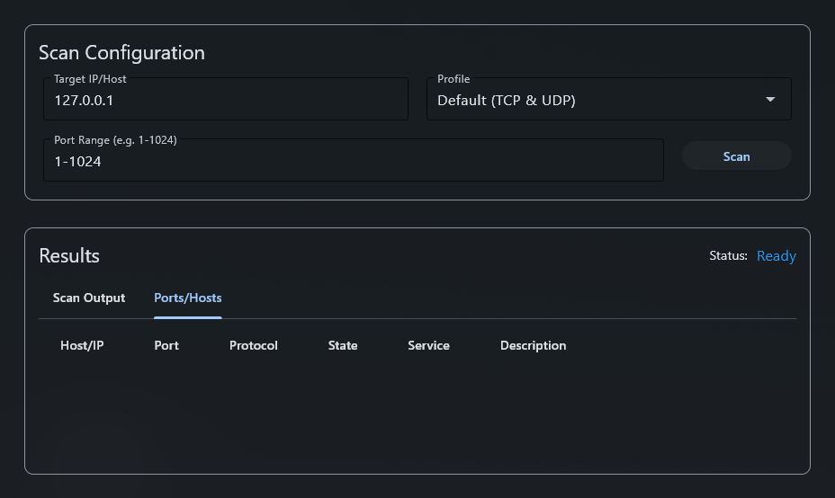

# Flet EasyScan

PythonのGUIフレームワーク [Flet](https://flet.dev/) を使用して作成された、ポートスキャナーアプリケーションです。
ネットワークの学習や、ローカル環境でのポート開放状態の確認などを手軽に行うことを目的としています。
低レイヤスキャンに対応しており、動作速度よりも安定性を優先しています。

## 画面構成



## 概要

このアプリケーションは、Scapyを利用してTCPおよびUDPポートスキャンを実行します。
直感的なUIでターゲットとポート範囲を指定し、スキャン結果をリアルタイムで確認できます。

## 主な機能

- **ターゲット指定:** IPアドレスまたはホスト名でスキャン対象を指定できます。
- **ポート範囲指定:** `1-1024`のような範囲指定や、`80,443,8080`のようなカンマ区切りの個別指定が可能です。
- **スキャンプロファイル:**
    - TCP & UDP (デフォルト)
    - TCPのみ
    - UDPのみ
- **リアルタイム結果表示:** スキャンの進捗と結果がリアルタイムでUIに表示されます。
- **2つの表示形式:**
    - **Scan Output:** スキャンログを時系列で表示します。
    - **Ports/Hosts:** オープン/フィルタリングされたポートをテーブル形式で分かりやすく表示します。
- **サービス名表示:** 一般的なポート番号に対応するサービス名と説明を表示します。

## 技術スタック

- **GUI Framework:** Flet
- **Packet Manipulation:** Scapy
- **Language:** Python

## 使い方

1. アプリケーションを起動します (`python main.py`)。
2. **Target(s)** フィールドに、スキャンしたいIPアドレスまたはホスト名を入力します。
3. **Port(s)** フィールドに、スキャンしたいポート番号を入力します。
    - 範囲指定: `1-1024`
    - 個別指定: `22, 80, 443, 8080`
4. **Scan Profile** ドロップダウンから、スキャンの種類を選択します。
5. **Start Scan** ボタンをクリックしてスキャンを開始します。
6. 結果は下のタブ (`Scan Output` / `Ports/Hosts`) にリアルタイムで表示されます。

## インストールと実行

1. **リポジトリをクローンします。**
   ```bash
   git clone <repository-url>
   cd flet-easyscan
   ```

2. **必要なライブラリをインストールします。**
   ```bash
   pip install flet scapy
   ```
   *注意: ScapyはNpcap (Windows) や libpcap (Linux/macOS) を必要とします。環境に応じてインストールしてください。*

3. **アプリケーションを実行します。**
   ```bash
   python main.py
   ```

## ⚠️ 注意事項

本プログラムは学習目的のために提供されています。
**許可なくローカルネットワーク外のホストに対してスキャンを実行しないでください。**

無断でのスキャン行為は、対象のネットワークに影響を与えたり、法的な問題を引き起こす可能性があります。
自己の責任において、管理下にあるネットワーク内でのみ使用してください。

## ライセンス

このプロジェクトは MIT License の下で公開されています。